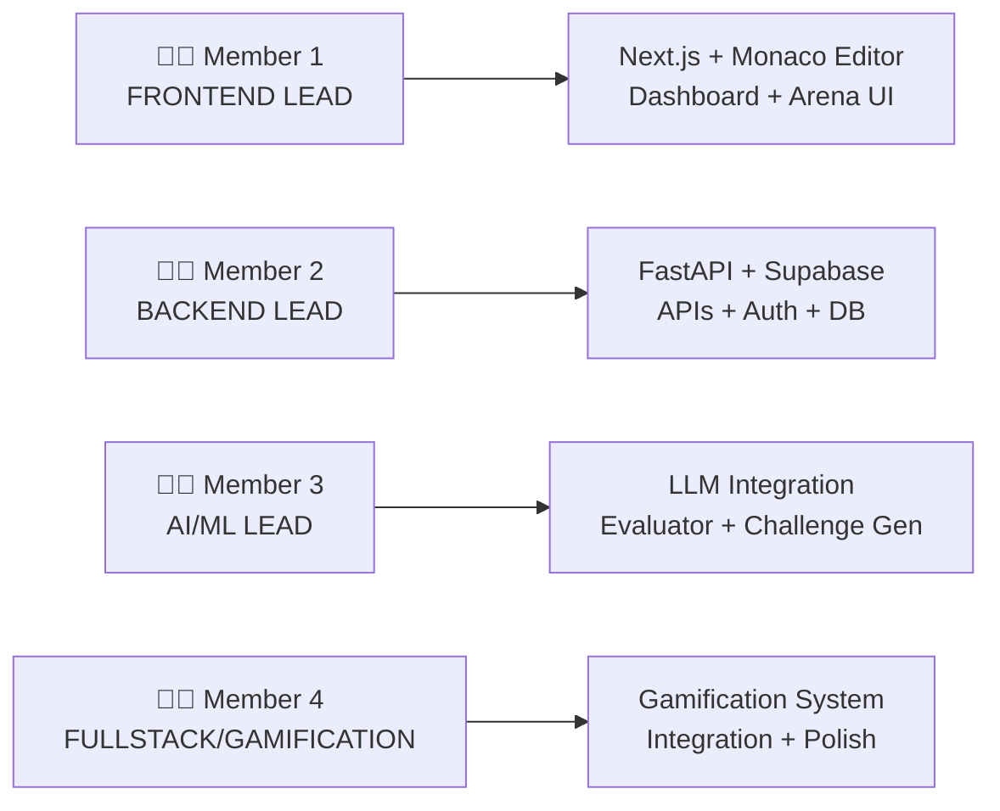

# SkillSprint: The Adaptive Arena — 24-Hour Hackathon Roadmap

## 🎯 Executive Summary

Build an **AI-powered adaptive coding platform** in 24 hours with 4 team members, using **100% free tools and APIs**. No credit card required.

---

## 🛠️ Recommended Tech Stack (All Free)

### Frontend
| Tool | Why | Free Tier |
|------|-----|-----------|
| **Next.js 14 (App Router)** | SSR, file-based routing, fast setup | ✅ Unlimited |
| **@monaco-editor/react** | VS Code-quality code editor in browser | ✅ Open source |
| **Chart.js / Recharts** | Skill radar charts & progress visualization | ✅ Open source |
| **Framer Motion** | Smooth animations for gamification | ✅ Open source |
| **Lucide React** | Beautiful icons | ✅ Open source |

### Backend
| Tool | Why | Free Tier |
|------|-----|-----------|
| **FastAPI (Python)** | Blazing fast, async, auto-docs | ✅ Open source |
| **Uvicorn** | ASGI server for FastAPI | ✅ Open source |

### AI / LLM Layer (💰 $0 Cost)
| Tool | Why | Free Tier Limits |
|------|-----|------------------|
| **Groq API** (Primary) | Fastest inference, Llama 3.3 70B | 30 RPM, 14,400 RPD (8B), 1,000 RPD (70B) |
| **Google Gemini API** (Fallback) | Generous limits, great reasoning | 15 RPM, 1,000 RPD (Gemini 2.5 Flash) |

> [!TIP]
> **Strategy**: Use Groq as primary (ultra-fast <1s responses), fall back to Gemini if rate-limited. Both require only a free API key — no credit card.

### Database
| Tool | Why | Free Tier |
|------|-----|-----------|
| **Supabase** | PostgreSQL + Auth + Realtime + Storage | 500MB DB, 50K MAUs, Unlimited API calls |

### Code Execution
| Tool | Why | Free Tier |
|------|-----|-----------|
| **Judge0 CE (Self-hosted via Docker)** | Secure sandboxed execution, 60+ languages | ✅ Open source, free |
| **Piston API** (Alternative) | No Docker needed, API-based | ✅ Free public API |

> [!IMPORTANT]
> For the hackathon demo, use **Piston API** (https://emkc.org/api/v2/piston) — it's a free public API with no auth required. Zero setup time. If you need more control later, self-host Judge0.

### Problem Sources (All Free, No Scraping)
| Source | Method | What You Get |
|--------|--------|--------------|
| **Codeforces API** | Official REST API (no auth needed) | 2,000+ problems with tags, difficulty ratings |
| **Kaggle LeetCode Dataset** | Download CSV/JSON | Problem statements, difficulty, topics, test cases |
| **HuggingFace `newfacade/LeetCodeDataset`** | Download dataset | Python problems with test cases |
| **LLM-Generated Problems** | Groq/Gemini API | Dynamic, personalized challenges based on skill gaps |

> [!NOTE]
> **Best approach**: Pre-load ~500 curated problems from Codeforces API + Kaggle datasets into Supabase. Use LLM to dynamically generate problems when the AI identifies specific weaknesses.

---

## 👥 Team Allocation (4 Members)



| Member | Role | Responsibilities |
|--------|------|------------------|
| **Member 1** | Frontend Lead | Next.js setup, Monaco editor, Arena UI, Dashboard, Skill Radar |
| **Member 2** | Backend Lead | FastAPI setup, Supabase schema, REST APIs, Auth, Code execution integration |
| **Member 3** | AI/ML Lead | Groq/Gemini integration, Prompt engineering, Code evaluator, Challenge generator, Skill analyzer |
| **Member 4** | Fullstack + Gamification | Leaderboard, XP system, Achievements, Boss fights UI, Help wherever bottlenecks appear |

---

## ⏱️ 24-Hour Timeline

### Phase 0: Setup & Foundation (Hours 0–2) — ALL MEMBERS

```
ALL MEMBERS TOGETHER:
├── Create GitHub repo + branch strategy (main + dev)
├── Set up project structure (monorepo)
│   ├── /frontend (Next.js)
│   ├── /backend (FastAPI)
│   └── /data (problem datasets)
├── Get API keys:
│   ├── Groq: console.groq.com (instant, free)
│   ├── Gemini: aistudio.google.com (instant, free)
│   └── Supabase: supabase.com (instant, free)
├── Initialize Supabase project + create tables
└── Download problem datasets (Kaggle + Codeforces)
```

**Commands to run:**
```bash
# Frontend
npx -y create-next-app@latest frontend --typescript --tailwind --eslint --app --src-dir --use-npm
cd frontend && npm install @monaco-editor/react recharts framer-motion lucide-react axios

# Backend
mkdir backend && cd backend
python -m venv venv
pip install fastapi uvicorn supabase groq google-generativeai httpx pydantic python-dotenv

# Download Codeforces problems
curl "https://codeforces.com/api/problemset.problems" -o data/codeforces_problems.json
```

---

### Phase 1: Core Infrastructure (Hours 2–6)

#### Member 1 — Frontend Foundation
```
Hours 2-4: Layout + Navigation
├── App layout with sidebar navigation
├── Dark theme with dungeon/arena aesthetic
├── Pages: /arena, /dashboard, /leaderboard, /profile
└── Responsive design

Hours 4-6: Code Editor (Arena Page)
├── Monaco editor integration (full VS Code editor)
├── Language selector (Python, JavaScript, C++, Java)
├── Problem description panel (split view)
├── Submit button + loading states
└── Output/result panel
```

#### Member 2 — Backend + Database
```
Hours 2-4: Database Schema + APIs
├── Supabase tables (see schema below)
├── FastAPI project structure
├── User auth endpoints (Supabase Auth)
├── CORS setup for frontend
└── Problem CRUD endpoints

Hours 4-6: Code Execution Pipeline
├── Piston API integration
├── POST /api/submit endpoint
├── Code execution with timeout (10s)
├── Test case runner (compare output)
└── Submission result storage
```

#### Member 3 — AI Engine Foundation
```
Hours 2-4: LLM Integration Layer
├── Groq client setup (primary)
├── Gemini client setup (fallback)
├── Rate limiter + automatic fallback logic
├── Base prompt templates
└── Response parsing utilities

Hours 4-6: Code Evaluator
├── Prompt: Analyze code for correctness, efficiency, style
├── Structured output: {score, feedback, weaknesses[], suggestions[]}
├── Test with sample submissions
└── Edge case handling (empty code, syntax errors, timeout)
```

#### Member 4 — Data Pipeline + Gamification Foundation
```
Hours 2-4: Problem Data Pipeline
├── Parse Codeforces API response into DB format
├── Parse Kaggle dataset into DB format
├── Seed Supabase with 200+ problems
├── Tag problems by: topic, difficulty, skills tested
└── Create problem difficulty mapping (Easy/Medium/Hard → numeric 1-10)

Hours 4-6: Gamification Schema + Basic Logic
├── XP system design (see gamification section)
├── Level progression logic
├── Achievement definitions (JSON config)
├── Streak tracking logic
└── Basic leaderboard query
```

---

### Phase 2: Core Features (Hours 6–12)

#### Member 1 — Interactive Arena
```
Hours 6-9:
├── Problem display with markdown rendering
├── Test case display (input/expected output)
├── Code submission flow (editor → API → result)
├── Real-time feedback display (AI evaluation)
├── Success/failure animations

Hours 9-12:
├── Skill radar chart (Recharts/Chart.js)
├── Dashboard page with stats cards
├── Recent submissions list
├── Progress bar / level indicator
└── Achievement badges display
```

#### Member 2 — API Completion
```
Hours 6-9:
├── GET /api/problems (with filters: topic, difficulty)
├── GET /api/problems/{id}
├── POST /api/submit (full pipeline: execute → evaluate → store)
├── GET /api/user/stats
├── GET /api/user/submissions

Hours 9-12:
├── GET /api/leaderboard
├── POST /api/challenge/next (adaptive next problem)
├── GET /api/user/skills (radar data)
├── WebSocket for real-time updates (optional)
└── Error handling + input validation
```

#### Member 3 — AI Brain
```
Hours 6-9: Skill Analyzer
├── Prompt: Extract skill dimensions from code
│   ├── Algorithm knowledge (1-10)
│   ├── Data structure usage (1-10)
│   ├── Code efficiency (1-10)
│   ├── Edge case handling (1-10)
│   ├── Code readability (1-10)
│   └── Problem-solving approach (1-10)
├── Aggregate scores across submissions
└── Identify top 3 weaknesses

Hours 9-12: Adaptive Challenge Generator
├── Prompt: Generate problem targeting specific weakness
├── Difficulty scaling based on user level
├── Problem format: {title, description, examples, test_cases, hints}
├── "Boss Fight" problem generator (harder, multi-skill)
└── Validate generated problems (sanity check)
```

#### Member 4 — Gamification + Integration
```
Hours 6-9:
├── XP award system (per submission)
├── Level-up logic + notifications
├── Achievement checker (after each submission)
├── Streak calculator (daily login/solve streaks)
└── Leaderboard ranking algorithm

Hours 9-12:
├── Boss fight flow (special challenge UI)
├── Integration testing (full flow: pick problem → solve → evaluate → update stats)
├── Fix bugs across frontend/backend
└── Help bottlenecked team members
```

---

### Phase 3: Polish & Gamification (Hours 12–18)

#### Member 1 — Visual Polish
```
├── Dungeon/arena theme refinement
├── Animations: level-up celebration, XP gain, streak fire 🔥
├── Boss fight page (dramatic UI with health bar)
├── Loading skeletons
├── Mobile responsiveness check
└── Particle effects for achievements
```

#### Member 2 — Performance & Edge Cases
```
├── API response caching
├── Database query optimization
├── Rate limiting on submission endpoint
├── Error handling improvements
├── API documentation (FastAPI auto-docs)
└── Environment variable management
```

#### Member 3 — AI Refinement
```
├── Prompt tuning (better evaluations)
├── Few-shot examples in prompts
├── Hint system (progressive hints for stuck users)
├── Code improvement suggestions
├── "Explain the solution" feature
└── Edge case: handle non-English code/comments
```

#### Member 4 — Features & Testing
```
├── Achievement unlock animations
├── Sound effects (optional, fun for demo)
├── End-to-end testing
├── Bug fixes
├── Data seeding for demo (fake user profiles with history)
└── README documentation
```

---

### Phase 4: Integration & Testing (Hours 18–21) — ALL MEMBERS

```
ALL MEMBERS:
├── Full integration testing
├── Fix critical bugs
├── Demo flow rehearsal
├── Seed demo data (impressive-looking dashboard)
├── Deploy frontend (Vercel — free)
├── Deploy backend (Railway free tier or Render free tier)
└── Ensure everything works on deployed URLs
```

---

### Phase 5: Demo Preparation (Hours 21–24) — ALL MEMBERS

```
├── Prepare demo script (3-5 minute walkthrough)
├── Record backup video (in case live demo fails)
├── Prepare presentation slides (problem → solution → demo → impact)
├── Practice Q&A (judges will ask about AI, scalability, uniqueness)
├── Final bug check on deployed version
└── SLEEP if possible 😴
```

---

## 🗄️ Database Schema (Supabase)

```sql
-- Users table (extends Supabase Auth)
CREATE TABLE profiles (
  id UUID PRIMARY KEY REFERENCES auth.users(id),
  username TEXT UNIQUE NOT NULL,
  display_name TEXT,
  avatar_url TEXT,
  xp INTEGER DEFAULT 0,
  level INTEGER DEFAULT 1,
  current_streak INTEGER DEFAULT 0,
  longest_streak INTEGER DEFAULT 0,
  last_solve_date DATE,
  created_at TIMESTAMPTZ DEFAULT NOW()
);

-- Problems table
CREATE TABLE problems (
  id SERIAL PRIMARY KEY,
  title TEXT NOT NULL,
  description TEXT NOT NULL,
  difficulty TEXT CHECK (difficulty IN ('easy', 'medium', 'hard', 'boss')),
  difficulty_score INTEGER CHECK (difficulty_score BETWEEN 1 AND 10),
  topics TEXT[] NOT NULL,           -- ['arrays', 'dynamic_programming', 'trees']
  skills_tested TEXT[] NOT NULL,    -- ['algorithm', 'edge_cases', 'efficiency']
  test_cases JSONB NOT NULL,       -- [{input: "...", expected: "..."}]
  hints TEXT[],
  source TEXT,                      -- 'codeforces', 'leetcode_dataset', 'ai_generated'
  source_id TEXT,                   -- original problem ID from source
  starter_code JSONB,              -- {python: "def solve(...):", javascript: "function solve(...){}"}
  created_at TIMESTAMPTZ DEFAULT NOW()
);

-- Submissions table
CREATE TABLE submissions (
  id SERIAL PRIMARY KEY,
  user_id UUID REFERENCES profiles(id),
  problem_id INTEGER REFERENCES problems(id),
  code TEXT NOT NULL,
  language TEXT NOT NULL,
  status TEXT CHECK (status IN ('accepted', 'wrong_answer', 'runtime_error', 'time_limit', 'pending')),
  execution_time_ms INTEGER,
  test_cases_passed INTEGER,
  total_test_cases INTEGER,
  ai_evaluation JSONB,            -- {score, feedback, weaknesses[], suggestions[]}
  xp_earned INTEGER DEFAULT 0,
  submitted_at TIMESTAMPTZ DEFAULT NOW()
);

-- Skill scores (updated after each submission)
CREATE TABLE user_skills (
  id SERIAL PRIMARY KEY,
  user_id UUID REFERENCES profiles(id),
  skill_name TEXT NOT NULL,        -- 'algorithm', 'data_structures', 'efficiency', etc.
  score DECIMAL(4,2) DEFAULT 5.0,  -- 1.0 to 10.0
  total_assessments INTEGER DEFAULT 0,
  updated_at TIMESTAMPTZ DEFAULT NOW(),
  UNIQUE(user_id, skill_name)
);

-- Achievements
CREATE TABLE user_achievements (
  id SERIAL PRIMARY KEY,
  user_id UUID REFERENCES profiles(id),
  achievement_key TEXT NOT NULL,    -- 'first_solve', 'streak_7', 'boss_slayer'
  unlocked_at TIMESTAMPTZ DEFAULT NOW(),
  UNIQUE(user_id, achievement_key)
);

-- Leaderboard (materialized view for performance)
CREATE VIEW leaderboard AS
SELECT
  p.id, p.username, p.display_name, p.avatar_url,
  p.xp, p.level, p.current_streak,
  COUNT(DISTINCT s.problem_id) FILTER (WHERE s.status = 'accepted') as problems_solved,
  RANK() OVER (ORDER BY p.xp DESC) as rank
FROM profiles p
LEFT JOIN submissions s ON p.id = s.user_id
GROUP BY p.id;
```

---

## 🤖 AI Prompt Templates

### Code Evaluator Prompt
```
You are an expert code evaluator for a competitive programming platform.

Analyze this code submission and return a JSON response:

**Problem:** {problem_title}
**Description:** {problem_description}
**Language:** {language}
**User Code:**
```{language}
{user_code}
```

**Test Results:** {passed}/{total} test cases passed

Evaluate and return ONLY valid JSON:
{
  "overall_score": <1-10>,
  "correctness": <1-10>,
  "efficiency": {
    "time_complexity": "<O(n), O(n²), etc.>",
    "space_complexity": "<O(1), O(n), etc.>",
    "score": <1-10>
  },
  "code_quality": <1-10>,
  "edge_case_handling": <1-10>,
  "feedback": "<2-3 sentence constructive feedback>",
  "weaknesses": ["<specific weakness 1>", "<specific weakness 2>"],
  "suggestions": ["<improvement suggestion 1>", "<improvement suggestion 2>"],
  "skill_scores": {
    "algorithm_knowledge": <1-10>,
    "data_structures": <1-10>,
    "code_efficiency": <1-10>,
    "edge_cases": <1-10>,
    "readability": <1-10>,
    "problem_solving": <1-10>
  }
}
```

### Challenge Generator Prompt
```
You are a coding challenge creator. Generate a problem that specifically 
targets the user's weakness in: {weakness_area}

User's current level: {user_level}/10
Desired difficulty: {difficulty}

Create a coding challenge in this JSON format:
{
  "title": "<creative problem title>",
  "description": "<clear problem statement with constraints>",
  "examples": [
    {"input": "...", "output": "...", "explanation": "..."}
  ],
  "test_cases": [
    {"input": "...", "expected_output": "..."}
  ],
  "hints": ["<hint 1>", "<hint 2>"],
  "topics": ["<topic1>", "<topic2>"],
  "optimal_approach": "<brief description of optimal solution>",
  "time_complexity_target": "<e.g., O(n log n)>"
}
```

---

## 🎮 Gamification System Design

### XP Awards
| Action | XP Earned |
|--------|-----------|
| Solve Easy problem | 50 XP |
| Solve Medium problem | 100 XP |
| Solve Hard problem | 200 XP |
| Defeat Boss | 500 XP |
| Daily streak bonus | +10 XP × streak_day |
| First attempt solve | +25 XP bonus |
| Perfect score (10/10 eval) | +50 XP bonus |

### Level Progression
```
Level 1: Novice Coder       (0 XP)
Level 2: Code Apprentice    (200 XP)
Level 3: Bug Squasher       (500 XP)
Level 4: Algorithm Adept    (1,000 XP)
Level 5: Data Warrior       (2,000 XP)
Level 6: Efficiency Expert  (3,500 XP)
Level 7: Pattern Master     (5,500 XP)
Level 8: Code Architect     (8,000 XP)
Level 9: Algorithm Legend    (12,000 XP)
Level 10: Arena Champion    (18,000 XP)
```

### Achievements
```
🏆 First Blood          — Solve your first problem
🔥 On Fire              — 3-day solve streak
⚡ Lightning Fast        — Solve within 5 minutes
🧠 Big Brain            — Get 10/10 AI evaluation
🐛 Bug Hunter           — Fix a wrong answer on retry
👑 Boss Slayer           — Defeat a Boss Fight
🎯 Sharpshooter          — 5 first-attempt solves in a row
📈 Growth Mindset        — Improve weakest skill by 3 points
🏔️ Peak Performance     — All skills above 7/10
💎 Diamond Coder         — Reach Level 10
```

---

## 📁 Project Structure

```
skillsprint/
├── frontend/                     # Next.js App
│   ├── src/
│   │   ├── app/
│   │   │   ├── layout.tsx        # Root layout with sidebar
│   │   │   ├── page.tsx          # Landing/home page
│   │   │   ├── arena/
│   │   │   │   └── page.tsx      # Code editor + problem
│   │   │   ├── dashboard/
│   │   │   │   └── page.tsx      # Stats + skill radar
│   │   │   ├── leaderboard/
│   │   │   │   └── page.tsx      # Rankings
│   │   │   └── profile/
│   │   │       └── page.tsx      # User profile + achievements
│   │   ├── components/
│   │   │   ├── CodeEditor.tsx    # Monaco editor wrapper
│   │   │   ├── ProblemPanel.tsx  # Problem description
│   │   │   ├── SkillRadar.tsx    # Radar chart
│   │   │   ├── XPBar.tsx         # Experience bar
│   │   │   ├── AchievementBadge.tsx
│   │   │   ├── LeaderboardTable.tsx
│   │   │   ├── BossFight.tsx     # Boss challenge UI
│   │   │   └── Sidebar.tsx       # Navigation
│   │   ├── lib/
│   │   │   ├── api.ts            # API client functions
│   │   │   └── supabase.ts       # Supabase client
│   │   └── styles/
│   │       └── globals.css       # Global styles + theme
│   ├── package.json
│   └── next.config.js
│
├── backend/                      # FastAPI App
│   ├── main.py                   # FastAPI app entry
│   ├── routers/
│   │   ├── problems.py           # Problem endpoints
│   │   ├── submissions.py        # Submission + execution
│   │   ├── users.py              # User profile + stats
│   │   ├── challenges.py         # AI challenge generation
│   │   └── leaderboard.py        # Rankings
│   ├── services/
│   │   ├── ai_evaluator.py       # Code evaluation with LLM
│   │   ├── challenge_generator.py # Dynamic problem generation
│   │   ├── skill_analyzer.py     # Skill scoring
│   │   ├── code_executor.py      # Piston/Judge0 integration
│   │   └── gamification.py       # XP, levels, achievements
│   ├── models/
│   │   └── schemas.py            # Pydantic models
│   ├── config.py                 # Environment config
│   ├── requirements.txt
│   └── .env
│
├── data/                         # Problem datasets
│   ├── codeforces_problems.json
│   ├── leetcode_dataset.csv
│   └── seed_db.py                # Script to seed Supabase
│
└── README.md
```

---

## 🚀 Deployment (Free)

| Component | Platform | Free Tier |
|-----------|----------|-----------|
| Frontend | **Vercel** | Unlimited deploys, custom domain |
| Backend | **Render** | 750 hours/month free (spins down after 15min idle) |
| Database | **Supabase** | 500MB, unlimited API calls |
| Alternative Backend | **Railway** | $5 free credit/month (enough for hackathon) |

### Deploy Commands
```bash
# Frontend → Vercel
cd frontend
npx vercel --prod

# Backend → Render
# 1. Push to GitHub
# 2. Connect repo to Render
# 3. Set build command: pip install -r requirements.txt
# 4. Set start command: uvicorn main:app --host 0.0.0.0 --port $PORT
```

---

## 🎤 Demo Strategy (Critical for Hackathon Judges)

### The "WOW" Flow (3-5 minutes)
1. **Open Dashboard** — Show the dungeon-themed UI with skill radar (pre-seeded data)
2. **Enter Arena** — Pick a problem, show the Monaco editor
3. **Submit Code** — Show real-time AI evaluation (score, feedback, skill update)
4. **Show Adaptation** — AI identifies weakness → generates targeted challenge
5. **Boss Fight** — Dramatic UI, harder challenge, defeat animation
6. **Leaderboard** — Show ranking + achievements panel
7. **Skill Growth** — Show before/after radar chart (the AI made the user better!)

### Judge Q&A Prep
| Question | Answer |
|----------|--------|
| "How is AI used?" | LLM evaluates code quality, identifies skill gaps, generates targeted challenges |
| "What makes this adaptive?" | AI tracks 6 skill dimensions, generates problems targeting weakest area |
| "How do you handle cost?" | Free LLM APIs (Groq + Gemini) with fallback, pre-loaded problem datasets |
| "Can it scale?" | Supabase handles auth + DB, stateless FastAPI, CDN-served frontend |
| "What about code security?" | Piston API runs code in isolated containers with timeouts |

---

## ⚠️ Risk Mitigation

| Risk | Mitigation |
|------|------------|
| Groq rate limit hit | Automatic fallback to Gemini API |
| Code execution API down | Cache last known result, show simulated output for demo |
| Supabase free tier limits | 500MB is plenty for hackathon; optimize queries |
| LLM returns invalid JSON | Retry with stricter prompt + JSON mode (Groq supports this) |
| Team member gets stuck | Member 4 (fullstack) is the "floater" to help anyone |
| Feature not done in time | Focus on core flow first: solve → evaluate → adapt |

---

## 🔑 API Keys Needed (All Free, No Credit Card)

1. **Groq** — https://console.groq.com → Create API Key
2. **Google Gemini** — https://aistudio.google.com → Get API Key
3. **Supabase** — https://supabase.com → New Project → Settings → API Keys
4. **Piston** — No key needed! Public API at `https://emkc.org/api/v2/piston`

---

## Open Questions

> [!IMPORTANT]
> 1. **Do you want me to start building the actual codebase?** I can scaffold the entire project (frontend + backend) and get you a working foundation immediately.
> 2. **Which member are you?** This helps me prioritize what to build first for you.
> 3. **Do you have any specific theme/color preference** for the "dungeon arena" aesthetic? (e.g., purple/dark, green matrix, cyberpunk neon)
> 4. **Auth requirement**: Do you need actual user login (Google OAuth via Supabase) or is demo mode (fake user) sufficient for the hackathon?
